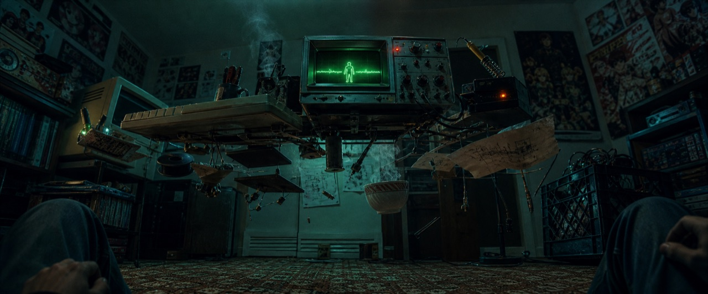
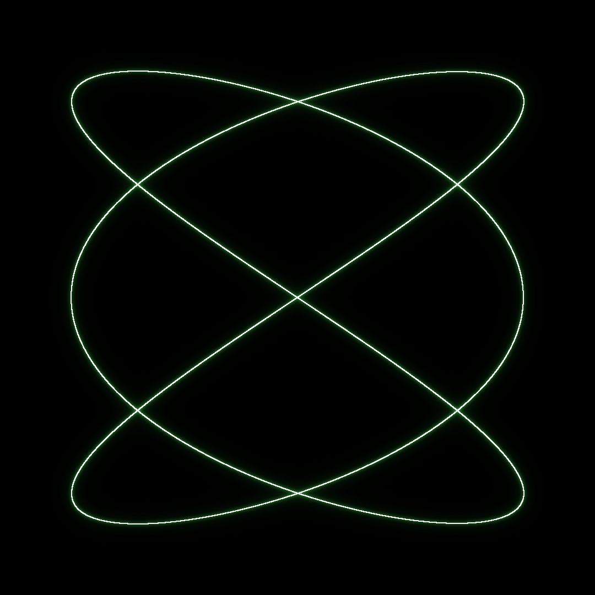
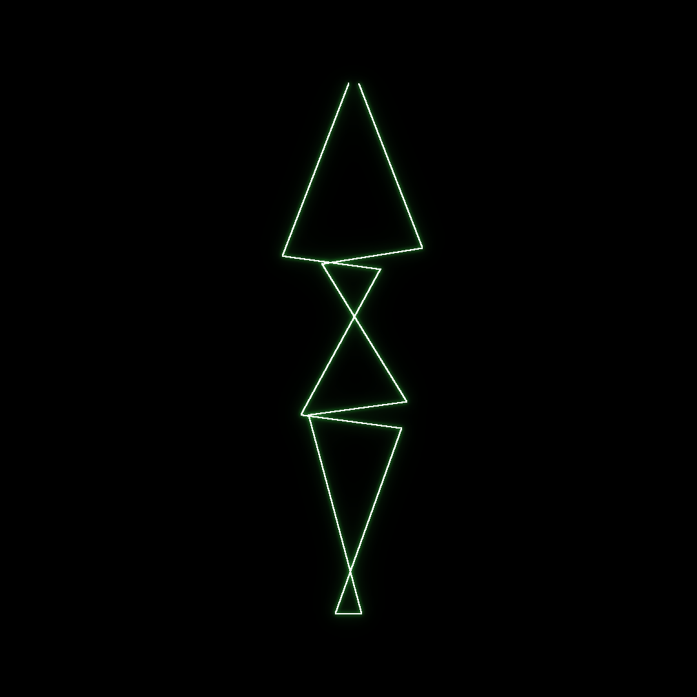
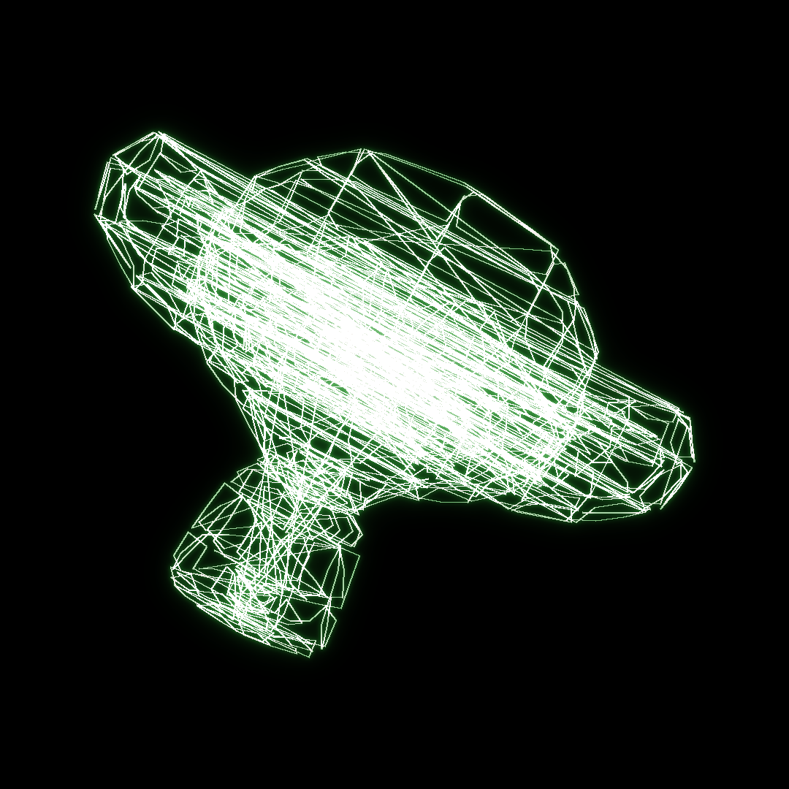
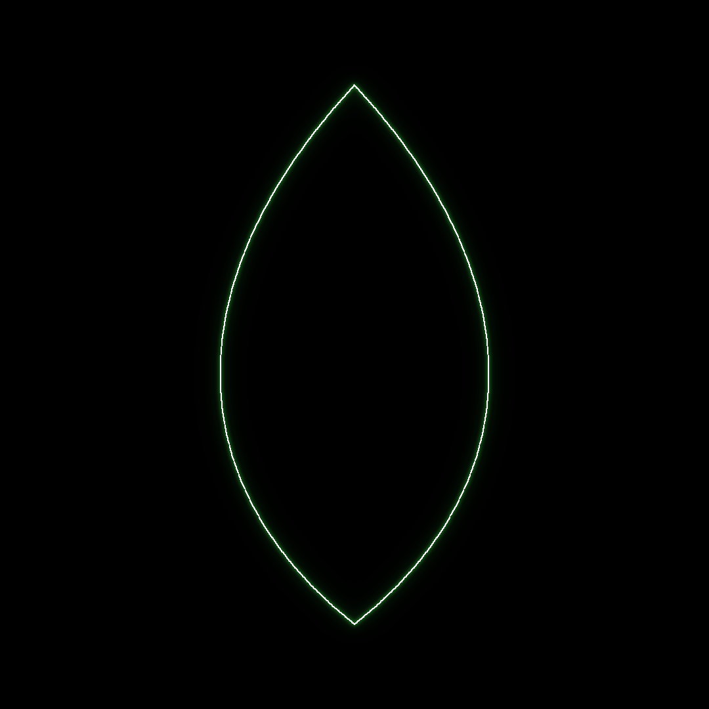
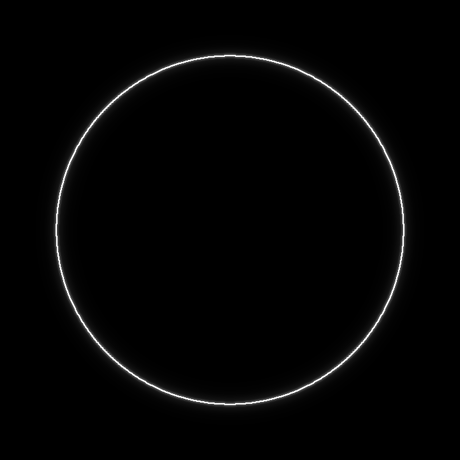

**English** · [Français](README.fr.md)

# oscli — headless oscilloscope (XY) toolkit

Turn vector shapes (SVG, OBJ, built-ins) into stereo **XY audio** plus phosphor-glow images, fully headless and scriptable. `oscli` fills a gap in the oscilloscope-music ecosystem: a command-line tool, where osci-render and OsciStudio are GUI apps.



> Le son EST l'image. The sound IS the image. (Oscilloscope XY mode: left channel drives X, right channel drives Y.)

## What's inside
- **oscli.py** — vector (SVG / OBJ / built-in) to WAV stereo XY plus PNG (and a rotating MP4). The core tool.
- **structure_circulaire.py / logo_loop.py** — morph animations (shape to shape) rendered to GIF/MP4 plus a real WAV (playable on a scope).
- **blender_to_osc.py** — Blender (headless) to OBJ to oscilloscope. Run with `blender -b -P blender_to_osc.py -- out.obj`.
- **viz_fiche.py / viz_schemas.py** — graphviz-based synoptic cards and technical diagrams (companion tooling).

## Install
Python 3, plus `numpy` and `pillow`. `ffmpeg` for GIF/MP4 export. `graphviz` (the `dot` binary) for the viz scripts.
```
pip install numpy pillow
```

## Usage
```
python3 oscli.py --input shape.svg     --out-wav out.wav --out-png out.png --freq 50
python3 oscli.py --input model.obj      --out-wav o.wav   --out-png o.png
python3 oscli.py --input builtin:lissajous --out-png liss.png
```
SVG support: `<path>` (M L H V C Q Z, absolute and relative) plus `<polyline>` / `<polygon>`. OBJ: vertices plus line edges. The WAV is a real signal: play it into an analog oscilloscope in XY mode (or into osci-render) and it redraws the image.

## Examples
Each still and loop below is rendered from audio.

   



A Lissajous figure, a jagged "bolt", Blender's Suzanne drawn by sound, an SVG traced by sound, and a circular morph (calm circle to bolt to Lissajous to spiral, looping). See also `examples/morph.mp4` and the full `examples/` folder.

## Ecosystem
[ECOSYSTEME.md](ECOSYSTEME.md) (in French) is a sourced catalog of the open-source oscilloscope / vector / Vectrex / laser scene (verified repos, the contemporary scene, festivals).

## Method
[METHODE.md](METHODE.md) (in French) : how to make oscilloscope cinema with free, orchestrated tools, and why (CC BY-SA).

## Lineage and credits
Built in the lineage of [osci-render](https://github.com/jameshball/osci-render) (James Ball) and [vectorsynthesis](https://github.com/macumbista/vectorsynthesis) (Derek Holzer). `oscli` is the headless command-line companion they do not provide. Thanks to the oscilloscope-music community.

## License
Code: MIT (see LICENSE). Texts (METHODE.md, ECOSYSTEME.md): CC BY-SA 4.0 (see LICENSE-DOCS.md).
Author: Ismaël Joffroy Chandoutis.

By [Ismaël Joffroy Chandoutis](https://ismaeljoffroychandoutis.com).
